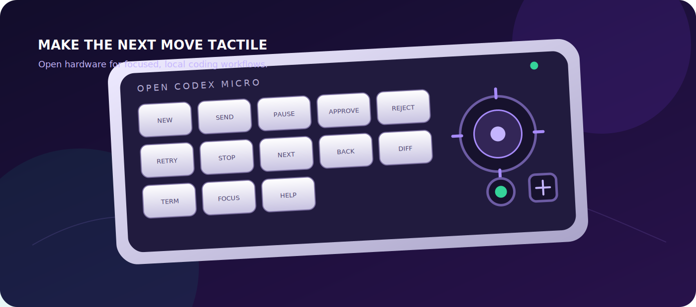

# Open Codex Micro — العربية

[English](README.md) · **العربية** · [简体中文](README.zh-CN.md) · [Español](README.es.md)

### حوّل سير عمل البرمجة إلى أدوات ملموسة بين يديك.

Open Codex Micro هو لوحة مفاتيح صغيرة ومفتوحة المصدر وقابلة للإصلاح، صُممت
لتسهيل الأعمال المتكررة أثناء استخدام أدوات البرمجة المساعدة والوكلاء البرمجيين.

## ماذا تحتوي؟

- 13 مفتاحاً قابلاً للبرمجة
- عصا تحكم ثنائية الاتجاه مع زر ضغط
- قرص دوّار مع زر
- مستشعر لمس اختياري
- إضاءة حالة RGB
- اتصال USB HID يعمل كلوحة مفاتيح عادية
- برمجية CircuitPython تعمل على Raspberry Pi Pico أو RP2040

## ابدأ من هنا

1. راجع [دليل المكونات والتوصيل](hardware/README.md).
2. اتبع [قائمة البناء السريعة](docs/BUILD-CHECKLIST.md).
3. انسخ ملفات [البرمجية](firmware/circuitpython/README.md) إلى لوحة `CIRCUITPY`.
4. عدّل الاختصارات من ملف [`config.py`](firmware/circuitpython/config.py).

> ابدأ بالمفاتيح فقط، ثم أضف العصا والقرص والإضاءة بالتدريج. لا توصل 5 فولت إلى
> أي منفذ GPIO في لوحة RP2040.

هذا مشروع مستقل وغير تابع لـ OpenAI أو Work Louder. أُنشئ بواسطة **قصي البحري**
بمساعدة أدوات الذكاء الاصطناعي في العصف الذهني والمراجعة.

الموقع: [albahri.org](https://albahri.org)

